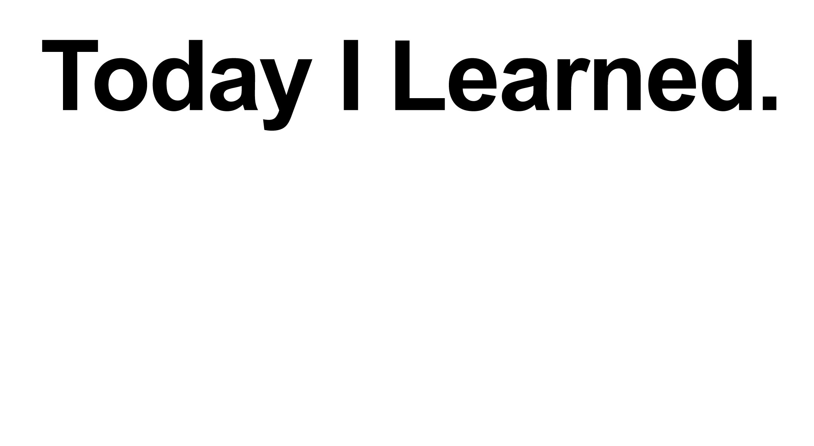

### 오늘 한 것
- 온라인 강의 듣기 (JS 데이터)
- Javascript 실시간 강의 듣기 (박영웅 강사님)
- 클론 코딩 과제 (git clone, configuration)
---
### 새롭게 알게된 것
#### **변수 선언 키워드**
`const`와 `let` 키워드가 블록 레벨 스코프를 가진다는 것에 대한 의미를 제대로 알게되었다. `var`는 함수 레벨 스코프!

#### **내 코드를 읽는 사람은 내 동료다.**
동료가 읽기 때문에 나 뿐만 아니라 동료가 읽기 쉽도록 들여쓰기하는 습관을 가져야하고, 기교를 부린 코드는 지양해야한다. 알아보는 것이 중요!

---
### KEEP.
#### **1 Action, 1 Commit**
커밋의 기본 원칙은 '1 Action, 1 Commit'이라 한다. 이번 클론 코딩 과제를 하면서 한 가지 일을 수행할 때마다 commit을 해보고 있다. 과제 시간이 촉박하지 않는 이상 계속 유지해 보자.

---
### Problem.

#### **JS 데이터 불변성**
강의 중 JS 데이터의 불변성과 얕은 복사, 깊은 복사 내용이 너무 어려웠다.😰
여기에 멈춰있기엔 시간 낭비가 될 것 같으니 일단 진도부터 나가고 계속 반복 학습을 하면서 익히자❗️

---
### Try.

#### **배운 내용 실습해보기**
박영웅 강사님께서 아직 낯선 JS문법에 익숙해지는 법은 자주 실습하는 수 밖에 없다고 하셨다.
주말을 활용하는 것도 하나의 방법이라고 하셨다! 실시간 강의가 없는 날에 실습하며 익히자
